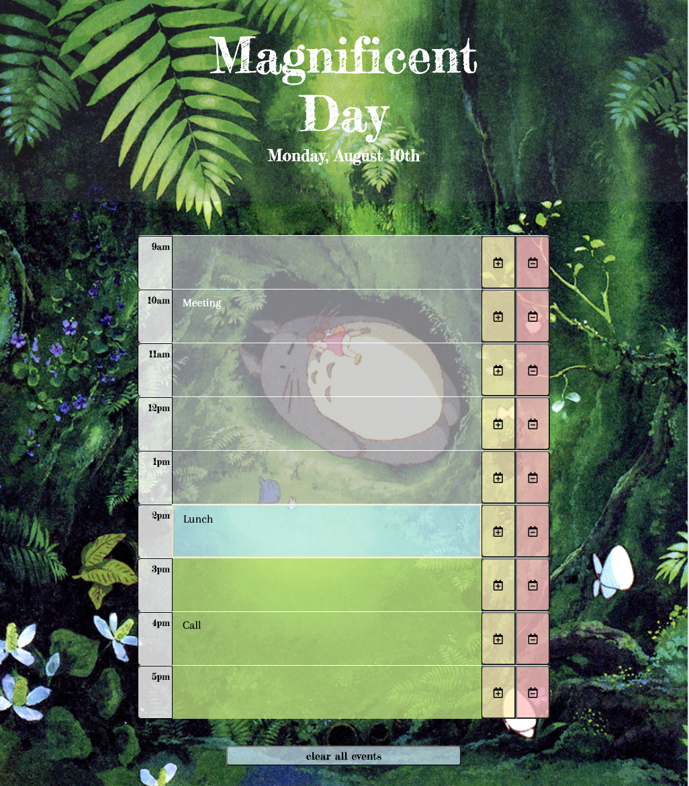

# Totoro-Day-Planner

A Totoro themed day planner to help users keep track of events during the work day.  The date is displayed at the top of the page, and the background image changes with each day of the week.  Users can enter events into timeblocks and save them upon clicking the "+" button.  Saved events will remain even if the page is refreshed.  Users can clear hour blocks with the corresponding "-" button, or clear the entire day's events with the "clear all events" button at the bottom of the page.

<a href='https://grimmgr.github.io/Totoro-Day-Planner/'>Totoro Day Planner</a>

